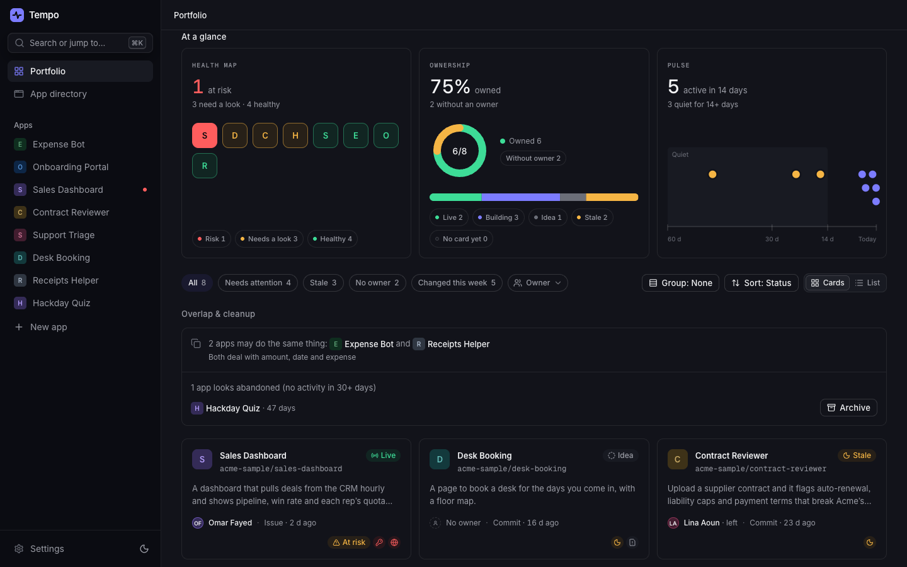
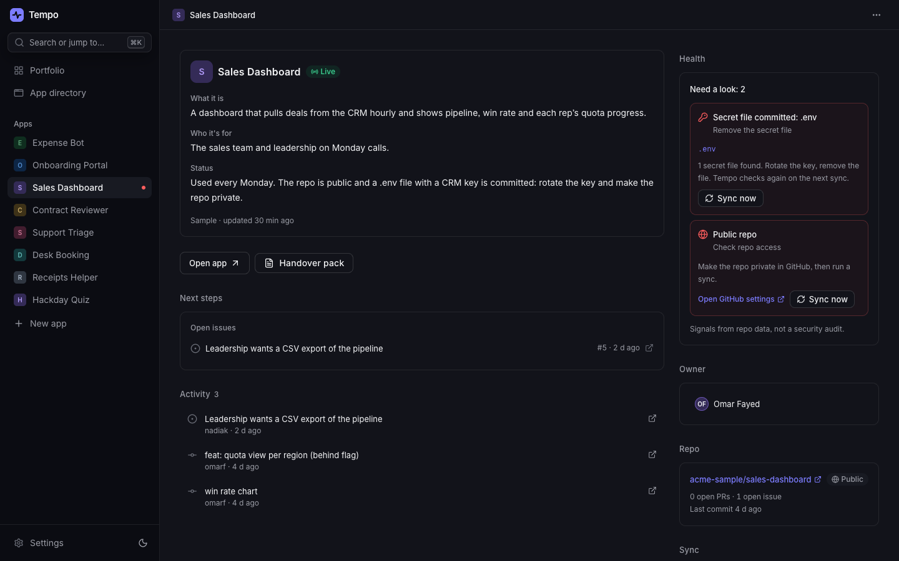

# Tempo

**Know every app your company vibe-coded: what it is, who owns it, whether it's alive.**

People now build internal tools in an afternoon with Claude Code, Codex, Cursor or Lovable. A few months later nobody
can say how many there are, what each one does, who looks after it, or which one has an API key committed to a public
repo.

Tempo reads each app's GitHub repo and keeps, for every app:
- an **app card**: what it is, who it's for, its stage (idea, building, live or stale) and a short status;
- **health signals**: no owner, owner has left, a committed `.env` or key file, a public repo, no commits in 14+ days,
  no README;
- **next steps**: the repo's open issues and pull requests, and tasks for each problem Tempo flags.

Tempo runs on your own accounts. To get your copy, see [Install it with Claude](#install-it-with-claude) and
[Self-hosting](#self-hosting).


*The portfolio: every app at a glance, with health, ownership and activity across the top, and each app's flags on its tile.*


*An app page: what the app is, what needs a look and how to fix it, and what's next.*

The screenshots use Tempo's fictional sample company, Acme.

## What's in it

- **Portfolio:** every app in one place with its stage, owner, last activity and health flags, plus filters (needs
  attention, stale, no owner, changed this week), grouping and a list view.
- **App page:** the card, the repo, health signals with the fix for each ("rotate the key, then remove the file"),
  next steps, tasks and an activity feed of commits, pull requests and issues.
- **Updates on every push:** with Tempo's GitHub App installed, a push refreshes that app's facts within seconds, and a
  daily check catches anything missed. No AI runs for this, and no code is read.
- **Review queue:** AI only drafts. Every drafted card waits for a person to check it.
- **Overlaps and quiet apps:** apps that seem to do the same job, and apps with no activity for a month.
- **Handovers:** when an owner leaves, the app is flagged, and Tempo drafts a handover pack on request.
- **People:** owners and admins, invite links, and placeholders for people who haven't signed in yet.
- **Your data:** export everything as JSON at any time, and import it back.

## AI: connect Claude, or bring your own key

Tempo works without AI: the card starts from the repo description, and health flags, overlaps and next steps come from
fixed rules. AI writes the descriptions and tasks for you, in one of two ways:

- **Claude through MCP.** Tempo is an MCP server (`/api/mcp`). Connect it in Claude (on the web, the desktop app or
  Claude Code) and send one message. Claude reads your portfolio as you and writes drafts back. It uses your own Claude
  plan, so Tempo pays for no AI and stores no AI key. Other MCP clients that support OAuth sign-in can connect to the
  same address.
- **Your own API key:** Claude, OpenAI, Google Gemini, OpenRouter, Groq, a local Ollama, or any OpenAI-compatible
  endpoint. The key stays in your browser and goes only to that provider. With a key, Sync does everything itself.

Either way, an AI answer is validated against a schema, cleaned and capped, and saved as a draft for a person to check.
Nothing an AI returns is run or shown as HTML.

## Security

- **Read-only GitHub access.** You sign in through a GitHub App that can only read the repos you choose, so Tempo can't
  push, merge or change settings.
- **The GitHub token never reaches the page's scripts.** It's sealed with AES-256-GCM in a `__Host-` cookie that is
  HttpOnly, Secure and SameSite=Strict, and one small server function forwards read requests to GitHub through an
  allowlist of paths.
- **Workspace isolation.** Every table has Postgres row-level security, so members only see their own workspace.
  `supabase/tests/rls.sql` proves it inside a rolled-back transaction.
- **AI apps get a narrow door.** A connected AI app signs in as the person, can call only a handful of database
  functions, and can write only drafts. Revoking it in Settings cuts it off at once.
- **Secrets are redacted** from repo text before any AI sees it, and from every MCP answer.
- **Sign-ins end** after 14 days unused, and 30 days after sign-in at the latest.
- **No tracking.** Cookieless page counts only.

The full model, the known gaps and how to report a problem are in [SECURITY.md](SECURITY.md).

## Install it with Claude

The quickest way to your own copy is to let Claude walk you through it:

```bash
git clone https://github.com/rolf-x/Tempo-Community.git
cd Tempo-Community
claude          # then type /setup
```

Claude follows the runbook in [AGENTS.md](AGENTS.md):
- **What it does itself:** it checks your tools, runs the commands it can, and checks each step before the next.
- **What you do:** it tells you exactly what to click in Supabase, Vercel and GitHub, with every value filled in.

It never asks you to paste a secret into the chat. Another coding agent can do the same: ask it to "follow the
self-hosting runbook in AGENTS.md".

Two helpers do the fiddly parts:
- `scripts/setup/github-app.mjs` creates your GitHub App in one click, with every setting filled in.
- `scripts/setup/vercel-env.mjs` sets all the Vercel variables without showing a single secret.

## Try it locally

You need Node 20.19+ (or 22.12+).

```bash
npm install
npm run dev     # http://localhost:5173
npm test        # unit tests
npm run build
```

**With no settings, you only get the landing page.** Signing in needs a Supabase project and a GitHub App. To run the
full app on your computer:
1. Do steps 1, 3 and 4 of [Self-hosting](#self-hosting). Add `http://localhost:5173/**` to the Supabase redirect URLs.
2. Copy `.env.example` to `.env.local` and fill in the browser values, plus `GITHUB_APP_CLIENT_ID` and
   `GITHUB_APP_CLIENT_SECRET`. The dev server runs the GitHub proxy, the GitHub App functions and the MCP server
   itself, and makes a fresh `GITHUB_TOKEN_KEY` each time it starts if you leave it empty.

In development, Tempo can send AI work to the `claude` command-line tool on your computer, on your Claude login,
instead of a paid API. Set `VITE_AI_LOCAL_ONLY=1` to keep every AI call there. Otherwise add an API key in Settings.

## Self-hosting

Everything runs on your own accounts:
- **Supabase:** database, sign-in, realtime, and the OAuth server that lets Claude connect.
- **Vercel:** hosting and the server functions.
- **Your own GitHub App:** read-only access to your repos.

**What's supported.** Tempo is built on those three services, so it's what's supported. A self-hosted Supabase may
work: the Content-Security-Policy in `vercel.json` only allows `wss://*.supabase.co`, and the MCP sign-in expects the
plain `https://<ref>.supabase.co` address. Other hosts or databases would mean porting code.

**The order matters a little:** the GitHub App needs your site's address and your Supabase address, and Vercel needs
the App's keys.

### 1. Supabase project
1. Create a project at [supabase.com](https://supabase.com) (the free plan is enough). The free plan allows two active
   projects per account: if you already have two, pause or delete one first.
2. Note the **Project URL**, `https://<ref>.supabase.co`, where `<ref>` is the project id in your dashboard's address.
3. In **Project Settings → API Keys**, note the **anon public** key. On newer projects it's under the **Legacy API
   keys** tab. Tempo never needs the service-role or secret key.

### 2. Database
Apply every file in `supabase/migrations/`, in order, 0001 to 0023. With the [Supabase CLI](https://supabase.com/docs/guides/local-development/cli/getting-started):

```bash
supabase init                          # once; it adds supabase/config.toml next to the migrations
supabase link --project-ref <ref>      # asks for your database password
supabase db push
```

Or use the **SQL Editor**: paste each file and run it, in order. You can also paste them all at once and run them as
one query (on a Mac, `cat supabase/migrations/*.sql | pbcopy` copies them in order). If the editor warns about
destructive operations, run it anyway: on a new project there's nothing to lose.

Then paste `supabase/tests/rls.sql` into the SQL Editor and run it.
- **If the editor offers to enable RLS on a table,** choose **Run without RLS**. The table is a temporary one the script
  removes.
- **A failed check** stops with an error that starts `FAIL:`. With no error, every check passed. The script ends with
  the notice **RLS: all checks passed**, which the editor may not show.
- **It rolls itself back,** so it leaves nothing behind. `authz_negative.sql` and `mcp_edge_cases.sql` in the same
  folder are optional extra checks that run the same way.

### 3. Vercel project
1. Fork this repo, then in [Vercel](https://vercel.com) choose **Add New → Project** and import your fork (the free
   Hobby plan works; see [Costs](#costs)).
   - The settings come from `vercel.json`: Vite, `npm run build`, `dist`, security headers and a daily cron.
   - The first deploy works without any variables, but sign-in stays off until step 6.
2. Note your address, such as `https://your-tempo.vercel.app`.

### 4. GitHub App
**One click:**

```bash
node scripts/setup/github-app.mjs --domain https://your-tempo.vercel.app --supabase https://<ref>.supabase.co
```

1. **Run it.** Add `--org <name>` to make the App belong to your organization, and `--private` if only that one
   account will install it.
2. **Create.** Your browser opens GitHub with every setting filled in. You check the name and press **Create GitHub
   App**.
3. **Keys.** The keys go to `.tempo-setup/github-app.json`, which only your user can read and git ignores. Nothing
   secret is printed.
4. **Install.** Install the App on the account or organization whose repos Tempo should see, from the link the helper
   prints.

The App's first webhook delivery, a ping, fails with 503 because Vercel doesn't have the keys yet. That's expected;
deliveries work once step 6 is done.

**Or by hand.** Go to GitHub → Settings → Developer settings → GitHub Apps → **New GitHub App** (or the same page in
your organization's settings) and fill it in:

| Field | Value |
|---|---|
| Homepage URL | `https://your-tempo.vercel.app` |
| Callback URL | `https://<ref>.supabase.co/auth/v1/callback` |
| Request user authorization (OAuth) during installation | off |
| Setup URL | empty |
| Webhook | Active, URL `https://your-tempo.vercel.app/api/github-webhook`, secret from `openssl rand -hex 32` (keep it for `GITHUB_WEBHOOK_SECRET`) |
| Repository permissions | Contents, Deployments, Issues, Metadata, Pull requests: **Read-only** |
| Organization permissions | Members: **Read-only** |
| Account permissions | Email addresses: **Read-only** |
| Subscribe to events | Push, Repository |
| Where can it be installed | Any account (or only this account, if one account is enough) |

After you create it:
1. Note the **App ID**, the **Client ID** and the slug (the last part of `https://github.com/apps/<slug>`).
2. **Generate a client secret.**
3. **Generate a private key**, which downloads a `.pem` file.
4. **Install App** on your account or organization.

### 5. Sign-in settings in Supabase
| Where | Setting |
|---|---|
| Authentication → Providers → GitHub | On. Client ID and client secret: **the GitHub App's** (Tempo refreshes and revokes those tokens itself). |
| Authentication → Providers → Email | Off. Tempo signs in with GitHub only. |
| Authentication → URL Configuration | Site URL `https://your-tempo.vercel.app`. Redirect URLs `https://your-tempo.vercel.app/**` (plus `http://localhost:5173/**` for local development). |
| Authentication → OAuth Server | On, with authorization path `/oauth/consent`, and **dynamic client registration** on (the dashboard calls it **Allow Dynamic OAuth Apps**). This is what lets Claude and other AI apps connect. |
| Project Settings → JWT Keys | Asymmetric signing keys (recommended): the MCP server checks tokens against your project's published keys. |

### 6. Vercel variables
**One command** sets all of them over stdin, never printing a secret. It needs a recent [Vercel CLI](https://vercel.com/docs/cli)
(one that knows `vercel env add --sensitive`), logged in, and this folder linked with `vercel link`:

```bash
node scripts/setup/vercel-env.mjs --site-url https://your-tempo.vercel.app \
  --supabase-url https://<ref>.supabase.co --anon-key <anon key> --contact-email you@yourcompany.com
```

**Or by hand,** in Vercel → Settings → Environment Variables (Production). `.env.example` describes each one:

| Variable | Value |
|---|---|
| `VITE_SITE_URL` | Your address, such as `https://your-tempo.vercel.app` (no trailing slash) |
| `VITE_CONTACT_EMAIL` | Where people ask to delete their account. Optional: without it, the Privacy page says to ask whoever runs your Tempo |
| `VITE_SUPABASE_URL`, `VITE_SUPABASE_ANON_KEY` | From step 1 |
| `VITE_GITHUB_APP_SLUG` | The App's slug |
| `VITE_AI_MODE` | `both` (Claude through MCP, or your own key), `mcp` (Claude only) or `legacy` (your own key only) |
| `GITHUB_APP_ID`, `GITHUB_APP_CLIENT_ID`, `GITHUB_APP_CLIENT_SECRET` | From the App |
| `GITHUB_APP_PRIVATE_KEY` | The whole `.pem`, or one line with `\n` for each line break |
| `GITHUB_WEBHOOK_SECRET` | The webhook secret you gave the App |
| `GITHUB_TOKEN_KEY` | `openssl rand -base64 32` (it must be 32 bytes) |
| `TEMPO_SERVER_KEY` | `openssl rand -base64 48` |
| `CRON_SECRET` | `openssl rand -hex 32` (Vercel Cron sends it to the daily check) |

**Then give the database the server key's fingerprint.** It stores only the SHA-256, never the key. The helper prints
this line ready to run. By hand, use `printf %s "<the TEMPO_SERVER_KEY value>" | shasum -a 256`, then run in the SQL
Editor:

```sql
insert into public.server_keys (name, key_hash) values ('github', '<sha-256 hex>')
  on conflict (name) do update set key_hash = excluded.key_hash;
```

**Deploy again** (Deployments → Redeploy, or push to your main branch) so the new values are used.

### 7. Your address and contact email
Two placeholders become yours at build time. There's nothing to edit by hand, as long as both variables are set
(step 6 sets them):
- **Link previews.** `index.html`'s link-preview tags (`og:url`, `og:image`, `twitter:image`) hold `%VITE_SITE_URL%`.
  Vite replaces it with your `VITE_SITE_URL`.
- **Contact email.** The Privacy page's contact line uses `VITE_CONTACT_EMAIL`.

If you change either value later, deploy again.

### 8. Check it works
- **Sign in.** Open your address, sign in with GitHub, create a workspace and add a few repos.
  - If sign-in fails with "Unsupported provider: provider is not enabled", the GitHub provider in step 5 is off or wasn't
    saved.
  - Tempo guesses which repos are apps. To add one it filed under **Not apps** (for example one marked "Empty"), open
    that list and click **This is an app**.
- **Updates on every push.** **Settings → Integrations** should say they're on. Push a commit to one of those repos:
  its app shows the new commit within a minute.
- **Each endpoint answers as expected:**

  ```bash
  curl -s -o /dev/null -w '%{http_code}\n' https://your-tempo.vercel.app/api/mcp                       # 401: needs a sign-in
  curl -s -o /dev/null -w '%{http_code}\n' -X POST https://your-tempo.vercel.app/api/github-webhook     # 401: unsigned
  curl -s https://your-tempo.vercel.app/.well-known/oauth-protected-resource/api/mcp                    # JSON naming your Supabase
  ```

  If the last one answers `temporarily_unavailable`, the OAuth Server in step 5 is off.

- **Claude.** To connect it, open **Settings → Connect your AI**.

Once your hosting has the values, delete `.tempo-setup/` or keep it somewhere safe: it holds the App's private key.

### Costs
Everything runs on your own accounts:
- **Supabase's free plan** covers a small team. It allows two active projects per account, and free projects pause
  after a week with no activity.
- **Vercel's free Hobby plan** is for personal, non-commercial use. A company should use Vercel Pro.
- **AI** is billed to your own Claude plan or API key.

## How it's built

- **Stack:** Vite, React 19, TypeScript, Tailwind CSS 4, Zustand with IndexedDB, zod, framer-motion; Supabase (Postgres
  with row-level security, Auth, Realtime, the OAuth 2.1 server); Vercel functions for the GitHub proxy, the webhook,
  the daily check and the MCP server.
- **AI features** each have a written procedure in `architecture/`. One router validates every answer against a zod
  schema (`src/ai/router.ts`), and small pure tools in `src/ai/tools/` clean each result.
- **Contributing:** see [AGENTS.md](AGENTS.md) for the commands, the layout and the rules a change has to keep.

## License

Tempo is released under the [Functional Source License, Version 1.1, MIT Future License](LICENSE) (FSL-1.1-MIT).
- **You can:** use it, change it and run your own copy, including inside your company.
- **You can't:** offer it, or something built from it, as a commercial product or service that competes with Tempo.
- **Two years later:** each release also becomes available under the MIT license two years after it's published.

This summary isn't legal advice: [LICENSE](LICENSE) is the binding text.
